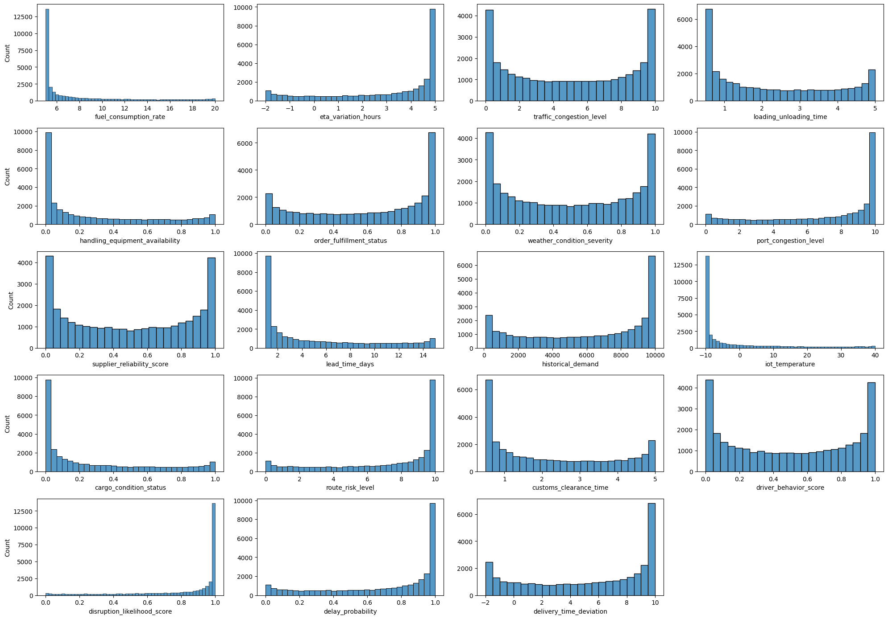
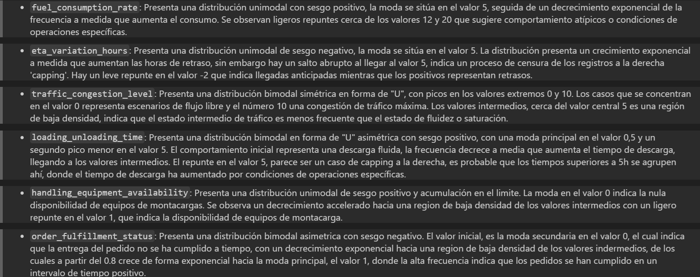

# Logistics & Supply Chain: EDA y Detección de Datos Sintéticos

📌 Resumen del Proyecto
Este proyecto estaba destinado a ser un proyecto de EDA Y machine learning. Quería resolver la demora en la entrega de los pedidos pero debido a la naturaleza sintética de los datos, este proyecto ha quedado como un análisis de variables que se encuentran en datasets de logística. He conservado mi trabajo en este proyecto porque he mejorado mi análisis de las variables además de aprender a identificar rápidamente un dataset sintético.

🔧 Instalación de las dependencias:
Para la instalacion de este proyecto debe de instalar kagglehub para poder ejecutar el script que descarga el dataset de kaggle.
pip install kagglehub

🚀 Funcionalidades Clave
> Análisis de las variables

📊 Resultados 

## Preview

